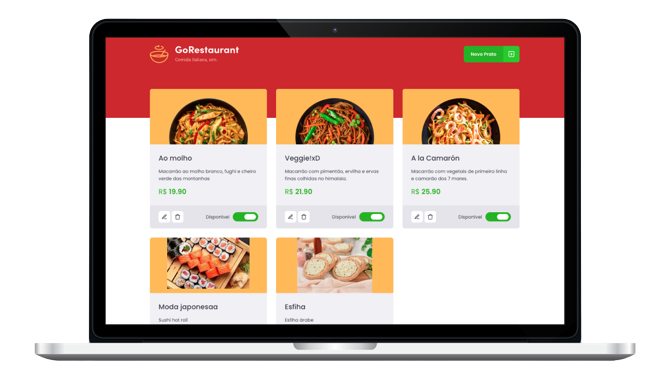

# Go Restaurant &middot;  

## 🖥 Functionalities
- Add, edit and remove foods for a restaurant

 

## 📝 License

MIT License © Yuri Paiva. Check [LICENSE](LICENSE) for more details

 

Made with 💜 &nbsp;by Yuri Paiva